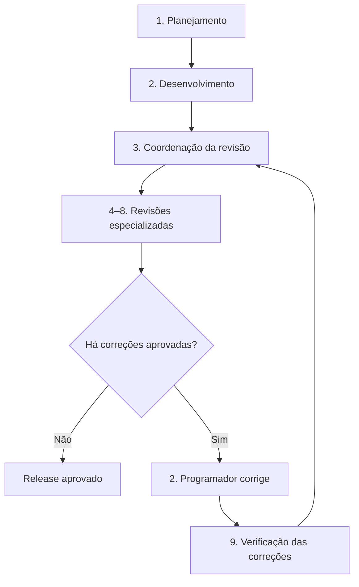

# Skills Codex — Engenharia Profissional

Pacote de skills para planejar, revisar e evoluir projetos de software com responsabilidades separadas, gates de aprovação e rastreabilidade.

## Skills incluídas

- `project-discovery-architect`: **1 — Planejamento — Arquiteto de Projetos**.
- `software-developer`: **2 — Desenvolvimento — Programador de Software**.
- `engineering-review-board`: **3 — Engenharia — Coordenador de Revisão**.
- `code-quality-reviewer`: **4 — Qualidade — Revisor de Código**.
- `architecture-reliability-reviewer`: **5 — Arquitetura — Arquiteto de Software**.
- `application-security-reviewer`: **6 — Segurança — Especialista em Segurança**.
- `qa-test-reviewer`: **7 — Testes — Engenheiro de QA**.
- `ux-accessibility-reviewer`: **8 — Experiência — Especialista em UX e Acessibilidade**.
- `remediation-verifier`: **9 — Validação — Verificador de Correções**.

## Ordem de atuação

| Ordem | Setor e função | Responsabilidade principal |
| ---: | --- | --- |
| 1 | Planejamento — Arquiteto de Projetos | Entende o problema, questiona requisitos, compara alternativas e registra decisões |
| 2 | Desenvolvimento — Programador de Software | Implementa somente o escopo e o plano aprovados até o próximo gate |
| 3 | Engenharia — Coordenador de Revisão | Abre a revisão, aciona especialistas e consolida o veredito |
| 4 | Qualidade — Revisor de Código | Procura defeitos, complexidade e problemas de manutenção |
| 5 | Arquitetura — Arquiteto de Software | Avalia estrutura, desempenho, dados, crescimento e recuperação |
| 6 | Segurança — Especialista em Segurança | Identifica vulnerabilidades, ameaças e controles ausentes |
| 7 | Testes — Engenheiro de QA | Verifica critérios de aceite, testes e riscos de regressão |
| 8 | Experiência — Especialista em UX e Acessibilidade | Avalia jornadas, clareza, celular e tecnologias assistivas |
| 9 | Validação — Verificador de Correções | Confirma se os achados foram resolvidos sem criar novas falhas |

As etapas 4–8 são coordenadas pela etapa 3 e podem ocorrer em paralelo quando forem aplicáveis. Se o parecer exigir correções, a etapa 2 volta a atuar somente após aprovação do plano. A etapa 9 encerra o ciclo confirmando as correções.



## Princípios

- Projetos começam pela identificação de projeto novo ou existente.
- Decisões estruturais exigem alternativas, recomendação e aprovação explícita.
- A equipe avança somente até o próximo gate aprovado.
- Achados críticos e altos bloqueiam releases.
- Correções são planejadas e aprovadas antes de alterar o código.
- Riscos aceitos exigem justificativa, responsável e prazo de reavaliação.

Cada skill está em `skills/<nome-da-skill>/` com seu `SKILL.md`, metadados de interface e referências necessárias.

## Como instalar

### Opção 1 — Clonar o repositório

```bash
git clone https://github.com/Bonisengna/skillscodex.git
```

Copie as pastas que estão dentro de `skillscodex/skills/` para a pasta de skills do Codex:

**Linux ou macOS**

```bash
mkdir -p ~/.codex/skills
cp -R skillscodex/skills/* ~/.codex/skills/
```

**Windows PowerShell**

```powershell
New-Item -ItemType Directory -Force "$HOME\.codex\skills"
Copy-Item -Recurse -Force ".\skillscodex\skills\*" "$HOME\.codex\skills\"
```

Depois, abra uma nova conversa ou reinicie o Codex para que as skills instaladas sejam descobertas.

### Opção 2 — Instalar somente uma skill

Copie apenas a pasta desejada, preservando toda a sua estrutura. Exemplo:

```text
~/.codex/skills/project-discovery-architect/
├── SKILL.md
├── agents/
└── references/
```

Não copie somente o `SKILL.md`, pois algumas skills dependem dos arquivos em `references/`.

## Como acionar uma skill

Use o nome da skill com o prefixo `$` no início ou no corpo do pedido.

```text
Use $project-discovery-architect para planejar um sistema de busca e candidatura a vagas.
```

Também é possível descrever a necessidade naturalmente. Quando a skill estiver instalada e a descrição corresponder ao pedido, o Codex poderá selecioná-la automaticamente. Para ter controle explícito, prefira mencionar `$nome-da-skill`.

## Fluxo recomendado

### 1. Começar ou retomar um projeto

```text
Use $project-discovery-architect para analisar este projeto. Antes de tomar decisões, descubra se ele é novo ou existente, faça as perguntas necessárias, compare alternativas e pare no próximo gate de aprovação.
```

A skill começará identificando uma das duas rotas:

- **Projeto novo:** descoberta do problema, usuários, resultados, regras, restrições e critérios de sucesso.
- **Projeto existente:** inventário do estado atual, falhas, riscos, dívida técnica e partes que devem ser preservadas.

Ela não deverá escolher stack, arquitetura ou escopo definitivo sem apresentar opções e receber aprovação.

### 2. Desenvolver até um marco relevante

Depois que descoberta, escopo, arquitetura e plano forem aprovados, a implementação pode avançar até o próximo gate. Exemplos de marcos:

- conclusão de uma funcionalidade central;
- mudança em autenticação ou permissões;
- criação ou migração de banco de dados;
- nova API, webhook, upload ou integração;
- preparação para publicação.

```text
Use $software-developer para implementar o escopo aprovado. Preserve as decisões registradas, execute os testes relevantes e pare no próximo gate sem fazer deploy.
```

### 3. Executar a banca de revisão

```text
Use $engineering-review-board para revisar este marco antes do release. Consolide código, arquitetura, segurança, QA, usabilidade e acessibilidade. Não altere o código antes de apresentar o plano de correção e receber minha aprovação.
```

O coordenador poderá usar os especialistas aplicáveis e produzir:

1. `ENGINEERING_REVIEW_REPORT.md` — achados, evidências, severidade e veredito.
2. `REMEDIATION_PLAN.md` — ordem e estratégia das correções.
3. `ACCEPTED_RISKS.md` — riscos adiados com justificativa, responsável e prazo.
4. `REVERIFICATION_REPORT.md` — confirmação das correções e regressões.

Achados críticos ou altos bloqueiam o avanço. Achados médios exigem plano, responsável e prazo.

### 4. Aprovar e corrigir

Após ler o relatório, aprove a estratégia desejada de forma explícita:

```text
Aprovo o plano de correção proposto para os achados SEC-001 e CODE-002. Use $software-developer para aplicar somente essas correções, executar os testes definidos e parar antes de qualquer mudança adicional.
```

### 5. Reverificar

```text
Use $remediation-verifier para confirmar se SEC-001 e CODE-002 foram resolvidos e se as mudanças introduziram alguma regressão.
```

O verificador deverá reproduzir o problema original, testar a correção e classificar cada achado como resolvido, parcialmente resolvido, não resolvido, regressão introduzida ou inconclusivo.

## Quando usar cada skill diretamente

| Ordem e nome exibido | Identificador técnico | Exemplo de uso |
| --- | --- | --- |
| 1 — Planejamento — Arquiteto de Projetos | `$project-discovery-architect` | Planejar um projeto novo ou diagnosticar um existente |
| 2 — Desenvolvimento — Programador de Software | `$software-developer` | Implementar um plano ou uma correção aprovada |
| 3 — Engenharia — Coordenador de Revisão | `$engineering-review-board` | Fazer uma revisão completa de um marco ou release |
| 4 — Qualidade — Revisor de Código | `$code-quality-reviewer` | Revisar lógica, complexidade e manutenção de uma mudança |
| 5 — Arquitetura — Arquiteto de Software | `$architecture-reliability-reviewer` | Avaliar arquitetura, desempenho, dados e recuperação |
| 6 — Segurança — Especialista em Segurança | `$application-security-reviewer` | Revisar autenticação, permissões, APIs, dados e integrações |
| 7 — Testes — Engenheiro de QA | `$qa-test-reviewer` | Avaliar testes, critérios de aceite e riscos de regressão |
| 8 — Experiência — Especialista em UX e Acessibilidade | `$ux-accessibility-reviewer` | Testar jornadas, responsividade e acessibilidade |
| 9 — Validação — Verificador de Correções | `$remediation-verifier` | Confirmar de forma independente as correções realizadas |

## Exemplo completo

```text
Use $project-discovery-architect.

Quero criar uma plataforma que pesquise vagas e ajude o usuário a se candidatar. Antes de propor arquitetura ou programar, determine se o projeto é novo ou existente, investigue objetivo, usuários, regras de negócio, integrações, custos, segurança e critérios de sucesso. Apresente alternativas com vantagens e riscos, recomende a opção mais viável e aguarde minha aprovação em cada gate.
```

Quando o projeto atingir um marco:

```text
Use $engineering-review-board para revisar a funcionalidade de cadastro e autenticação. Considere o código, arquitetura, segurança, testes, interface em desktop e celular e acessibilidade. Achados críticos e altos devem bloquear o release. Gere o relatório e o plano, mas não corrija nada antes da minha aprovação.
```
